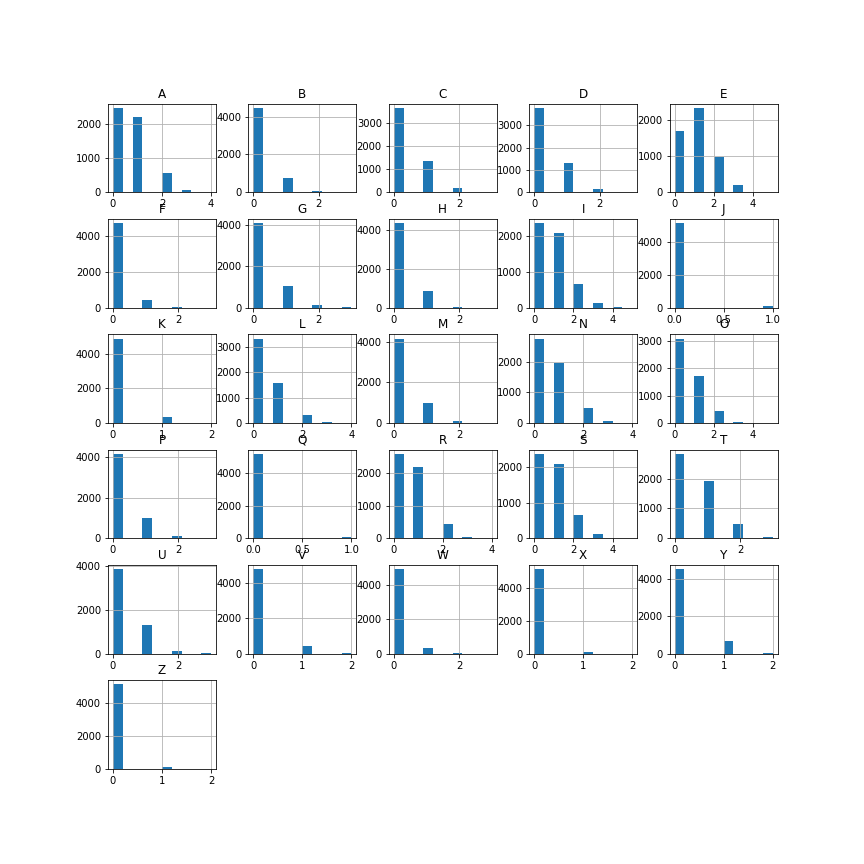

# Machine Learning Project: language identification

### Load libraries


```python
import pandas as pd
from pandas.plotting import scatter_matrix
from matplotlib import pyplot
from sklearn.model_selection import train_test_split
from sklearn.model_selection import KFold
from sklearn.model_selection import cross_val_score
from sklearn.metrics import classification_report
from sklearn.metrics import confusion_matrix
from sklearn.metrics import accuracy_score
from sklearn.linear_model import LogisticRegression
from sklearn.tree import DecisionTreeClassifier
from sklearn.neighbors import KNeighborsClassifier
from sklearn.discriminant_analysis import LinearDiscriminantAnalysis
from sklearn.naive_bayes import GaussianNB
from sklearn.svm import SVC
from sklearn.neural_network import MLPClassifier
import string
import collections
import pickle
```

## Parsing functions

### Removing stresses
In order to work with only ASCII characters for the chinese language _*pinyin*_ is used instead of _*hanzi*_, and every in every word stresses are removed.  


```python
def strip_stress(word):
    table = collections.defaultdict(lambda: None)
    table.update({
        ord('é'): 'e',
        ord('ô'): 'o',
        ord('è'): 'e',
        ord('à'): 'a',
        ord('ì'): 'i',
        ord('ù'): 'u',
        ord('\n'): '',
    })
    table.update(dict(zip(map(ord,string.ascii_uppercase), string.ascii_lowercase)))
    table.update(dict(zip(map(ord,string.ascii_lowercase), string.ascii_lowercase)))
    table.update(dict(zip(map(ord,string.digits), string.digits)))
    return word.translate(table,)
```

### Text to feature vector
This function converts every word into a feature vector where each feature is the amout of times a certain letter appears, if `scale` is set to `True` then the features will be scaled by dividing them by the total length of the word. 


```python
def parse_string(word, lang = None, scale = False):
   
    str(word)
    word = strip_stress(word.lower())
    length = len(word)
    LetterFreq={}
    for letter in string.ascii_lowercase:
        LetterFreq[letter] = 0
    for letter in word.lower():
        LetterFreq[letter] += 1
    features = list(LetterFreq.values())
    
    if(length < 1 or scale == False):
        features = [float(x) for x in features]
    else:
        features = [float(x)/length for x in features]
    
    if(lang != None):
        features.append(lang)
    
    return features
```

## Model selection

### Load dataset
We generate three separate DataFrames due to memory constraints, else we incurr into a `MemoryError`, the starting data is in the format:


```python
!tail ./Data/*.txt
```

    ==> ./Data/chinese.txt <==
    Longhai
    LongWang
    Longxin
    Longyouxian
    longtou
    Longfengqu
    Pangshipianju
    guierzi
    guibeizhu
    hei
    
    ==> ./Data/english.txt <==
    zealand
    zeds
    zero
    ziggurats
    zinc
    zipped
    zloty
    zoologists
    zounds
    �lan
    
    ==> ./Data/italian.txt <==
    zoofili
    zoppa
    zoppicate
    zotici
    zuccherato
    zucchini
    zuffolassi
    zufolare
    �rdono
    


```python
names = ['A', 'B', 'C', 'D', 'E', 'F', 'G', 'H', 'I', 'J', 'K', 'L', 'M', 'N', 'O', 'P', 'Q', 'R', 'S', 'T',
         'U', 'V', 'W','X', 'Y', 'Z', 'class']

dataset_it = pd.DataFrame((parse_string(word,'Italian') for word in open('./Data/italian.txt', encoding = "ISO-8859-1")), columns = names)
dataset_en = pd.DataFrame(([parse_string(word,'English') for word in open('./Data/english.txt', encoding = "ISO-8859-1")]), columns=names)
dataset_zh = pd.DataFrame(([parse_string(word,'Chinese') for word in open('./Data/chinese.txt', encoding = "ISO-8859-1")]) , columns = names)
```

Here we join the data from the three datasets


```python
dataset = pd.DataFrame()
dataset = dataset.append(dataset_it)
dataset = dataset.append(dataset_en)
dataset = dataset.append(dataset_zh)
```

 ### Visualization on the different letter frequency in the analyzed languages

```python
# Code used to generate the histograms
dataset_it.hist()
dataset_en.hist()
dataset_zh.hist()

pyplot.show()
```

 Italian | English | Chinese
 - | - | -  
  | | 

Zoomed version:

  Italian:
  
  
  English:
  
 
  Chinese:
  

### Split-out validation dataset


```python
array = dataset.values
X = array[:,0:26]
Y = array[:,26]
validation_size = 0.20
seed = 7
X_train, X_validation, Y_train, Y_validation = train_test_split(X,Y,test_size=validation_size, random_state=seed, shuffle=True)
```

### Spot-Check Algorithms
Here we train many different models with the training set as to compare their performances and pick the most promising one to use


```python
models=[]
models.append(('LR', LogisticRegression(multi_class='auto', solver='liblinear')))
models.append(('LDA',LinearDiscriminantAnalysis()))
models.append(('KNN', KNeighborsClassifier()))
models.append(('CART', DecisionTreeClassifier()))
models.append(('NB', GaussianNB()))
models.append(('SVM', SVC(gamma='scale')))
models.append(('MLP', MLPClassifier(solver='lbfgs', alpha=1e-5, hidden_layer_sizes=(30,10), random_state=3)))
```


```python
models=[]

models.append(('MLP', MLPClassifier(solver='lbfgs', alpha=1e-5, hidden_layer_sizes=(30,20,10,5), random_state=3)))
```

### Evalutate each model in turn


```python
results = []
names = []
for name, model in models:
    kfold = KFold(n_splits=10, random_state=seed) 
    cv_results = cross_val_score(model, X_train, Y_train, cv=kfold, scoring='accuracy')
    results.append(cv_results)
    names.append(name)
    msg = "%s: %f (%f)" % (name, cv_results.mean(), cv_results.std())
    print(msg)
```

### Compare Algorithms

```python
# Code used to generate the boxplots 
fig = pyplot.figure()
fig.suptitle('Algorithm comparison')
ax = fig.add_subplot(111)
ax.boxplot(results)
ax.set_xticklabels(names)
pyplot.show()
```

Model |With unscaled features: | With scaled features:
- | - | - 
 |  | 
LR | 0.786885 (0.009271)| 0.767812 (0.006941)
 LDA | 0.774308 (0.005538) | 0.763458 (0.005461)
KNN | 0.740793 (0.008171) | 0.760417 (0.012712)
CART | 0.705410 (0.008459)| 0.712391 (0.005213)
NB | 0.691453 (0.013798) | 0.684612 (0.013949)
SVM | 0.831181 (0.011519) | 0.791100 (0.009735)
MLP | 0.819709 (0.011321) | 0.801397 (0.010456)

### Make predictions with chosen model on validation dataset


#### Select a model (Support Vector) and train it with all the training data
We then make prediction for the validation set to extimate the final model's accuracy


```python
model = SVC(gamma='scale', probability=True)
model.fit(X_train, Y_train)
predictions = model.predict(X_validation)
```

### Final accuracy analysis 


```python
model_name = str(model).split('(')[0]
print("Model:",model_name,"\n")
print("Accuracy score:\n",accuracy_score(Y_validation, predictions))
print("\n\nConfusion matrix:\n")
data = {'y_Predicted': predictions,
        'y_Actual':    Y_validation
        }

df = pd.DataFrame(data, columns=['y_Actual','y_Predicted'])

confusion_matrix = pd.crosstab(df['y_Actual'], df['y_Predicted'], rownames=['Actual'], colnames=['Predicted'])
print (confusion_matrix)
print("\n\nClassification report:\n",classification_report(Y_validation, predictions))
```

    Model: SVC 
    
    Accuracy score:
     0.8366500829187397
    
    
    Confusion matrix:
    
    Predicted  Chinese  English  Italian
    Actual                              
    Chinese       1429       31       31
    English         84      698      258
    Italian         51      136      900
    
    
    Classification report:
                   precision    recall  f1-score   support
    
         Chinese       0.91      0.96      0.94      1491
         English       0.81      0.67      0.73      1040
         Italian       0.76      0.83      0.79      1087
    
       micro avg       0.84      0.84      0.84      3618
       macro avg       0.83      0.82      0.82      3618
    weighted avg       0.84      0.84      0.83      3618
    


### Save current model to file


```python
filename = 'finalized_model.sav'
pickle.dump(model, open(filename, 'wb'))
print("Saved", model)
```

    Saved SVC(C=1.0, cache_size=200, class_weight=None, coef0=0.0,
      decision_function_shape='ovr', degree=3, gamma='scale', kernel='rbf',
      max_iter=-1, probability=True, random_state=None, shrinking=True,
      tol=0.001, verbose=False)


### Load saved model


```python
filename = 'finalized_model.sav'
model = pickle.load(open(filename, 'rb'))
print("Loaded", model)
```

# Practical demo


```python
test_string = "Test"

classes = ["Chinese","English", "Italian"]

predictions = model.predict_proba([parse_string(test_string)]).tolist()[0]
best_guess = predictions.index(max(predictions))

print("The word", "\"\x1b[31m"+test_string+"\x1b[0m\"",  "was classified as", "\x1b[31m"+ classes[best_guess] +"\x1b[0m")
for i in range (0,3):
    print("\t"+classes[i]+":",round(predictions[i]*100, 3),"%")

```

    The word "Test" was classified as English
    	Chinese: 0.258 %
    	English: 79.301 %
    	Italian: 20.442 %

